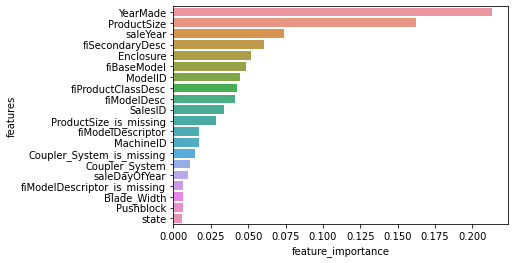

# Bulldozer-Price-Regression-Time-Series-Data

## 1. Problem Definition
How well can we predict the future price of a bulldozer?

## 2. Data
Data is downloaded from Blue Book for Bulldozers-Kaggle (https://www.kaggle.com/c/bluebook-for-bulldozers/overview). The data for this competition is split into three parts:

* Train.csv is the training set, which contains data through the end of 2011.
* Valid.csv is the validation set, which contains data from January 1, 2012 - April 30, 2012 You make predictions on this set throughout the majority of the competition. Your score on this set is used to create the public leaderboard.
* Test.csv is the test set, which won't be released until the last week of the competition. It contains data from May 1, 2012 - November 2012. Your score on the test set determines your final rank for the competition.

## 3. Evaluation
The evaluation metric for this competition is the RMSLE (root mean squared log error) between the actual and predicted auction prices.

## 4. Features
The key fields are in train.csv are:

* SalesID: the uniue identifier of the sale
* MachineID: the unique identifier of a machine. A machine can be sold multiple times
* saleprice: what the machine sold for at auction (only provided in train.csv)
* saledate: the date of the sale

## 5. Results
The lowest RMSLE is 0.2439, which ranked top 30 in Kaggle

## 6. Feature Importance
